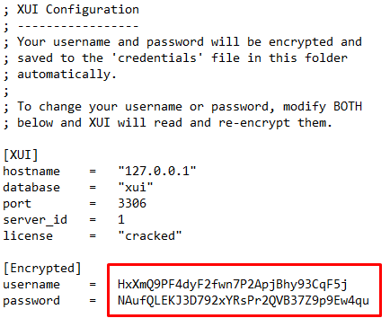

# Xui.One Cambiar Contrasena de Usuario

**Instruciones de como cambiar contrasena del usuario del XUI-ONE**

- Subir el archivo al Server
- Le damos permiso chmod +x xui-mysql.sh
- Ejecutamos ./xui-mysql.sh

- Elija la obcion: 1
- Se mostrara un listado y el usuario que cambiara sera el que tiene Host 127.0.0.1

- Elija la obcion: 3
- Introduce el nombre del usuario: HxXmQ9PF4dyF2fwn7P2ApjBhy93CqF5j
- Introduce la nueva contrasena: nueva contrasena
- Introduce el host: 127.0.0.1

- Luego que la cambies tienes que ir al archivo /home/xui/config/config.ini 
- para agregar los datos nuevos 

- Guardamo los datos.
- Ejecutamos esto para que los Loadbalance tomen los cambio 
- /home/xui/tools mysql

---

**Ya todo estara listo.....**
